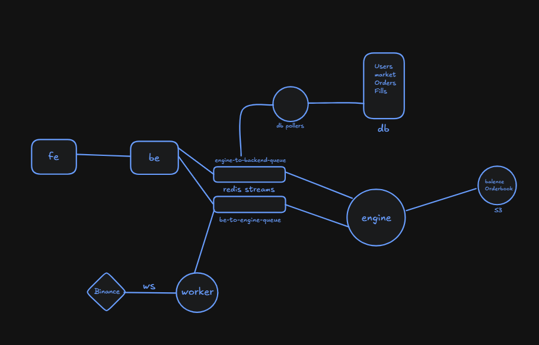

# perps-v2

A **perpetual-futures exchange** built from first principles — modeled on how production
trading venues are actually architected. A single in-memory matching engine at the core,
fronted by an event-driven mesh of independent services that communicate exclusively over
Redis Streams, with a live Binance price feed driving margin, leverage, and automated
liquidations.

This is an infrastructure project: the interesting parts are the matching engine,
the message-passing architecture, and the risk engine — not CRUD.

---

## What makes this technically interesting

Perpetual-futures venues are among the harder systems to get right. They demand
**deterministic low-latency matching**, **correct margin and leverage accounting**, and
**continuous risk management**, all while staying consistent under concurrent load.
`perps-v2` takes the production approach to each:

- **In-memory central limit order book.** A single-threaded engine owns all order books,
  balances, and positions in memory. Matching is deterministic and contention-free — the
  same reason real exchanges keep the hot path off the database.
- **Share-nothing, event-driven services.** API, matching, market data, and persistence are
  separate processes that coordinate *only* through append-only Redis Streams. The engine
  never blocks on I/O; services scale, deploy, and fail independently.
- **Asynchronous request/response over a log.** HTTP requests are correlated to engine
  results by `req_id`, so API latency is decoupled from engine throughput and persistence
  runs entirely off the critical path.
- **Real-time risk engine.** A dedicated worker streams Binance mark prices into the engine,
  which continuously marks positions to market and force-closes any that breach their
  liquidation price.

---

## Architecture



Every node is an independent Bun process. The **engine is the single source of truth** for
live state; every other service either feeds it or drains its output. There is no shared
database connection and no shared memory — all coordination flows through append-only streams,
which keeps the engine deterministic and its state replayable.

---

## How it works

### Order placement — request/response across a message bus
1. **`be`** validates the request (Zod), registers a pending promise keyed by a unique `req_id`,
   and publishes the order to the **be → engine** stream. The HTTP call awaits the result.
2. **`engine`** consumes the stream, matches against the in-memory book, updates positions,
   balances, and fills, and publishes the outcome (plus generated fills) to the
   **engine → be** stream.
3. **`be`** consumes that stream, correlates by `req_id`, and resolves the awaiting response.
4. **`db-poller`** independently consumes the same stream and persists orders and fills to Postgres.

The engine is never in the synchronous path of a database write, and the API is never blocked
by matching throughput — the two are linked only by an ordered log.

### Market data & liquidation
- **`worker`** subscribes to Binance's mark-price WebSocket and republishes onto the
  **worker → engine** stream.
- **`engine`** updates the live mark price and runs a continuous liquidation loop, force-closing
  positions whose mark price has crossed their liquidation threshold via synthetic market orders.

---

## Matching & risk: implementation notes

- **Price-time priority** matching with partial fills and resting limit orders, over
  `Map`-based price levels with incremental book pruning.
- **Market orders as bounded limit orders.** A market order matches only up to
  `lastTradedPrice ± slippage%`, fills what it can, and cancels the remainder — protecting
  takers from unbounded slippage while keeping the engine logic uniform.
- **Position netting.** One netted position per (user, market), correctly handling increase,
  reduce, flip, and close with weighted-average entry pricing.
- **Margin lifecycle.** `margin = (price × qty) / leverage`, moved from `available` to `locked`
  on entry and released on close; maintenance-margin-based liquidation pricing.

---

## Design decisions

- **Single-threaded engine over a distributed/locked one.** Determinism and simplicity beat
  raw parallelism for a matching core; correctness is far easier to reason about and the hot
  path stays in memory. Throughput scales by sharding per market, not by locking shared state.
- **Redis Streams over a request/response RPC.** An append-only log gives ordered, replayable,
  at-least-once delivery for free, naturally decouples producers from consumers, and lets
  persistence and risk consume the same event flow independently.
- **Engine state as source of truth, database as history.** Postgres records what happened
  (users, orders, fills); S3 snapshots let the engine rebuild live state. The database is never
  on the latency-critical path.

---

## Tech stack

| Layer | Choice |
|---|---|
| Runtime / language | Bun · TypeScript |
| Monorepo | Turborepo + Bun workspaces |
| API | Express · Zod |
| Auth | JWT · bcrypt |
| Messaging | Redis Streams |
| Database | Postgres · Prisma |
| State snapshots | S3 |
| Market data | Binance futures WebSocket |

---

## Repository layout

```
apps/
  backend/          Express API — auth + exchange endpoints, Redis request/response bridge
  engine/           In-memory matching + liquidation engine (the core)
  price-ws-worker/  Binance mark-price feed → Redis
  db-poller/        Redis → Postgres persistence
packages/
  common/           Shared Zod schemas + engine event types
  db/               Prisma schema + generated client
```

---

## Running locally

> **Prerequisites:** Bun, Redis, and Postgres running locally.

```bash
bun install

# .env (repo root)
#   DATABASE_URL=postgresql://...
#   JWT_SECRET=...

# start each service in its own terminal
cd apps/engine          && bun run dev
cd apps/backend         && bun run dev
cd apps/price-ws-worker && bun run dev
cd apps/db-poller       && bun run dev
```

### API

| Method | Route | Auth | Description |
|---|---|---|---|
| `POST` | `/signup` | – | Create account, returns JWT |
| `POST` | `/signin` | – | Authenticate, returns JWT |
| `POST` | `/order` | ✅ | Place a market or limit order |
| `GET`  | `/balance` | ✅ | Account balance |
| `GET`  | `/positions/:market` | ✅ | Open position for a market |

---

## Roadmap

The core trading path — matching, positions, leverage, and liquidations — is functional.
Work in progress:

- S3 state snapshotting and crash recovery (snapshot + stream replay)
- Durable Postgres persistence pipeline
- Trading frontend
- Funding-rate mechanism
- Order and fill history endpoints
- `bigint` migration for exact monetary precision
- Per-market engine sharding for horizontal throughput
